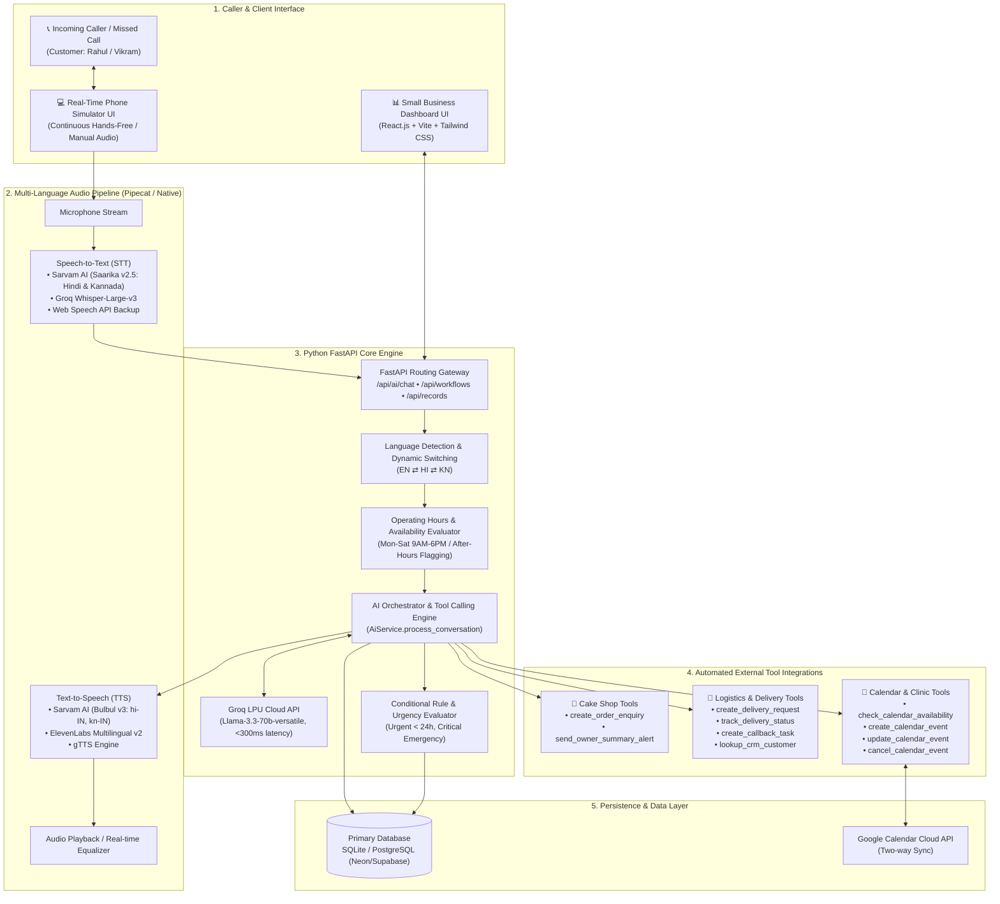
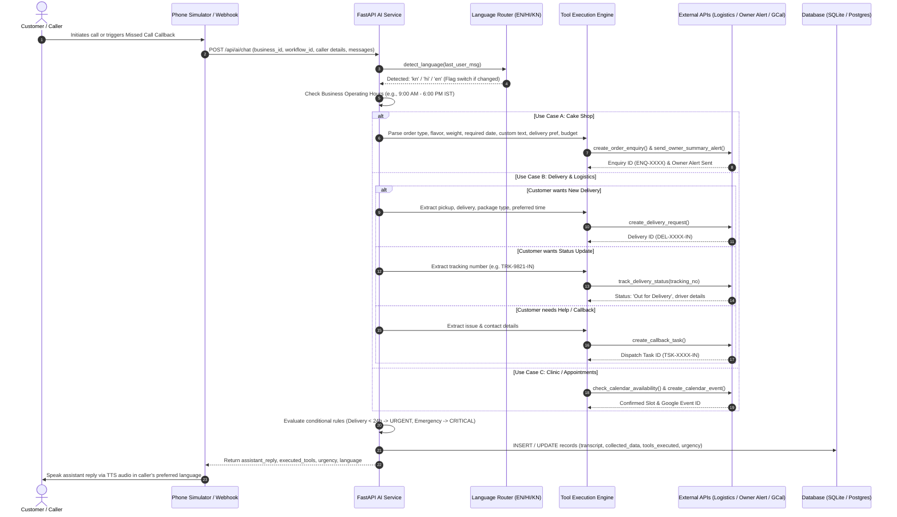
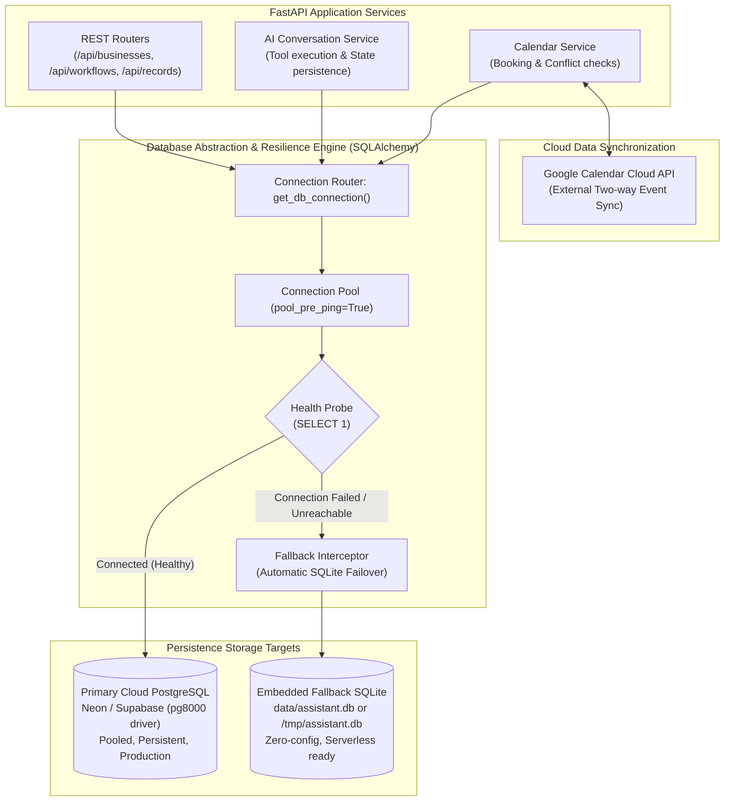
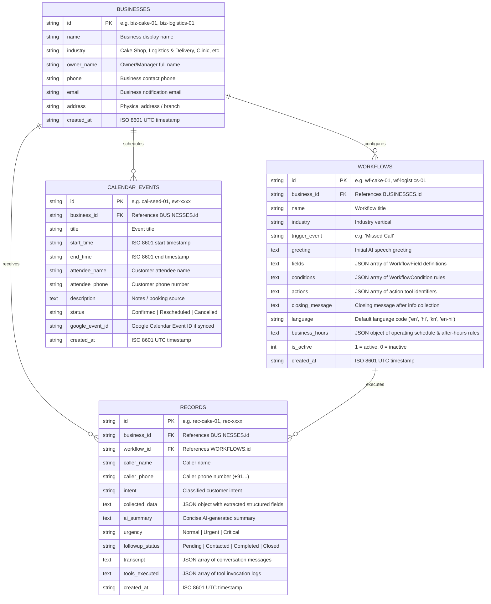
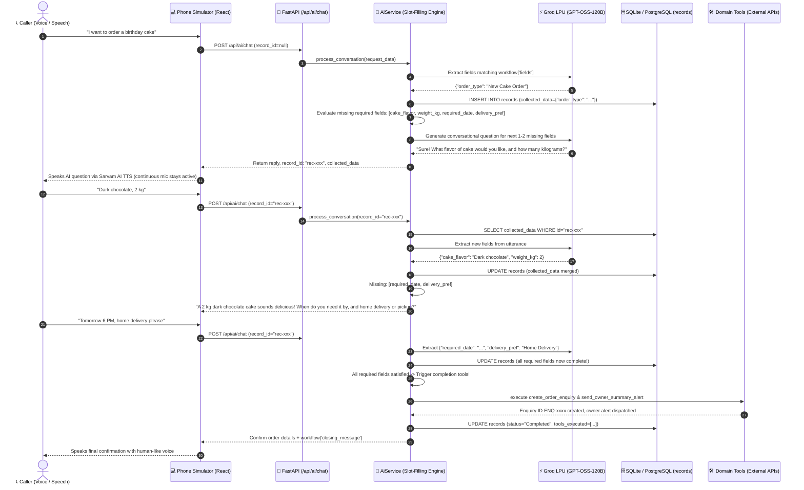

# System Architecture Blueprint & Workflow Data Model

This document details the decoupled architecture, tool calling execution engine, multi-language voice engine, entity-relationship database schema, and workflow data models for the **Voice AI Personal Assistant**.

---

## 1. High-Level Architecture Diagram




---

## 2. Directory Architecture

```text
voice_ai/
├── frontend/                     # Pure React.js (Vite + TypeScript + Tailwind)
│   ├── src/
│   │   ├── components/           # Navbar, Dashboard, WorkflowBuilder, PhoneSimulator, BusinessProfiles, CalendarMonitor
│   │   ├── lib/                  # Frontend API Client (fetch wrapper)
│   │   ├── types/                # Shared TypeScript types (Business, Workflow, MissedCallRecord, CalendarEvent)
│   │   ├── App.tsx               # Main React Application shell
│   │   ├── main.tsx              # React Entry point
│   │   └── index.css             # Glassmorphism Tailwind styling
│   ├── index.html
│   ├── package.json
│   ├── vite.config.ts
│   └── tailwind.config.js
│
├── backend/                      # Python FastAPI Backend Server
│   ├── app/
│   │   ├── database.py           # Database connection & seed scripts (SQLite / PostgreSQL)
│   │   ├── models.py             # Pydantic data schemas
│   │   ├── services/             # AI Service, Calendar Service, External API Service, Voice Service
│   │   │   ├── ai_service.py     # Core conversation handler, language switcher, industry tool caller
│   │   │   ├── calendar_service.py # Google Calendar integration
│   │   │   ├── external_api_service.py # Cake Shop & Logistics API tools
│   │   │   └── voice_service.py  # Sarvam AI Bulbul/Saarika, Groq Whisper, ElevenLabs, gTTS
│   │   ├── routers/              # FastAPI REST endpoints (businesses, workflows, records, ai, tools)
│   │   └── main.py               # FastAPI entry point
│   ├── requirements.txt
│   └── data/                     # Local SQLite DB store
│
├── .env                          # Local environment secrets (Groq, Sarvam AI, Google)
├── ARCHITECTURE.md               # Architecture documentation & diagrams
└── README.md                     # Setup & installation guide
```

---

## 3. Sequence Diagram for Tool Calling & Missed Call Processing



---

## 4. Database Architecture & Schema

### 4.1 Database Architecture Overview

The **Voice AI Personal Assistant** employs a resilient, hybrid persistence architecture engineered for high availability, low-latency conversational state management, and deployment flexibility across cloud production, local development, and serverless environments.



#### Key Architecture Principles

1. **Dual-Engine Hybrid Persistence**:
   - **Production (Cloud PostgreSQL)**: Powered by PostgreSQL (via SQLAlchemy with `pg8000` driver compatible with Neon, Supabase, and Prisma Accelerate connection strings). Employs connection pooling with pre-ping validation (`pool_pre_ping=True`) to automatically reconnect on stale connections.
   - **Local & Serverless Fallback (SQLite)**: Operates out-of-the-box using embedded SQLite stored at `backend/data/assistant.db` (or `/tmp/assistant.db` in AWS Lambda / serverless runtimes). Configured with `check_same_thread=False` to support asynchronous multi-threaded FastAPI request workers.
2. **Zero-Downtime Connection Failover**:
   - The `get_db_connection()` utility executes an active connection probe (`SELECT 1`). If the cloud PostgreSQL instance fails or times out, the engine automatically catches the exception and falls back to the embedded SQLite store, ensuring the voice agent never drops calls due to transient database outages.
3. **Hybrid Relational + Document Model**:
   - High-cardinality core entities (`businesses`, `workflows`, `records`, `calendar_events`) are modeled as relational tables with strict foreign-key relations and standard indexing fields.
   - Variable, schema-less data (such as industry-specific workflow fields, dynamic condition rules, caller-extracted JSON attributes, conversational transcripts, and tool execution logs) are stored as JSON-serialized document columns. This eliminates complex migration overhead when creating new industry templates.
4. **Idempotent Self-Bootstrapping & Seeding**:
   - The schema initializes automatically at startup (`init_db()`), generating required tables if absent and running non-destructive column migrations (e.g., `ALTER TABLE workflows ADD COLUMN business_hours TEXT`).
   - The engine automatically seeds target industry profiles (Sweet Treats Bakery & SwiftMove Express) and default workflows if empty, ensuring instant turnkey deployment.

---

### 4.2 Entity-Relationship (ER) Schema




---

### 4.3 Detailed Table Specifications & Data Dictionary

#### 1. `businesses` Table
Represents multi-tenant business profiles registered within the system.

| Column | Data Type | Constraints | Description |
| :--- | :--- | :--- | :--- |
| `id` | `VARCHAR(64)` | PRIMARY KEY | Unique business identifier (e.g., `biz-cake-01`, `biz-logistics-01`) |
| `name` | `VARCHAR(255)` | NOT NULL | Registered trading name displayed across dashboards |
| `industry` | `VARCHAR(128)` | NOT NULL | Vertical classification (e.g., `Cake Shop`, `Logistics & Delivery`) |
| `owner_name` | `VARCHAR(255)` | NOT NULL | Primary point of contact / business owner name |
| `phone` | `VARCHAR(64)` | NOT NULL | Contact phone number for SMS/voice alerts |
| `email` | `VARCHAR(255)` | NOT NULL | Notification dispatch email |
| `address` | `TEXT` | NULLABLE | Physical branch or dispatch center address |
| `created_at` | `VARCHAR(64)` | NOT NULL | ISO 8601 timestamp of record creation |

#### 2. `workflows` Table
Configures the behavioral rules, dynamic speech greetings, form fields, and conditional actions executed by the AI engine.

| Column | Data Type | Constraints | Description |
| :--- | :--- | :--- | :--- |
| `id` | `VARCHAR(64)` | PRIMARY KEY | Unique workflow identifier (e.g., `wf-cake-01`) |
| `business_id` | `VARCHAR(64)` | NOT NULL, FK | References `businesses(id)` |
| `name` | `VARCHAR(255)` | NOT NULL | Descriptive title of the workflow |
| `industry` | `VARCHAR(128)` | NOT NULL | Target industry vertical |
| `trigger_event`| `VARCHAR(128)` | NOT NULL | Activation event (e.g., `Missed Call`, `Inbound Call`) |
| `greeting` | `TEXT` | NOT NULL | Initial opening line synthesized by TTS |
| `fields` | `TEXT (JSON)` | NOT NULL | Serialized JSON array of required/optional data fields (`WorkflowField[]`) |
| `conditions` | `TEXT (JSON)` | NOT NULL | Serialized JSON array of evaluation logic rules (`WorkflowCondition[]`) |
| `actions` | `TEXT (JSON)` | NOT NULL | Serialized JSON array of tool execution IDs to trigger |
| `closing_message`| `TEXT` | NOT NULL | Wrap-up speech prompt spoken when data collection finishes |
| `language` | `VARCHAR(32)` | DEFAULT `'en-hi'` | Primary default language code (`en`, `hi`, `kn`, `en-hi`) |
| `business_hours`| `TEXT (JSON)` | NULLABLE | Operating schedule, timezone, and out-of-hours response strategy |
| `is_active` | `INT` | DEFAULT `1` | Boolean flag (1 = Active, 0 = Disabled) |
| `created_at` | `VARCHAR(64)` | NOT NULL | ISO 8601 timestamp of record creation |

#### 3. `records` Table
Stores call interaction audit logs, AI-extracted form values, urgency ratings, and tool telemetry.

| Column | Data Type | Constraints | Description |
| :--- | :--- | :--- | :--- |
| `id` | `VARCHAR(64)` | PRIMARY KEY | Unique interaction ID (e.g., `rec-cake-01`, `rec-xxxx`) |
| `business_id` | `VARCHAR(64)` | NOT NULL, FK | References `businesses(id)` |
| `workflow_id` | `VARCHAR(64)` | NOT NULL, FK | References `workflows(id)` |
| `caller_name` | `VARCHAR(255)` | NOT NULL | Extracted caller identity or default `"Customer"` |
| `caller_phone` | `VARCHAR(64)` | NOT NULL | Customer caller phone number (+91 E.164 format) |
| `intent` | `VARCHAR(255)` | NOT NULL | Classified customer intent |
| `collected_data`| `TEXT (JSON)` | NOT NULL | Structured key-value object containing extracted entities |
| `ai_summary` | `TEXT` | NOT NULL | Concise LLM-generated call abstract |
| `urgency` | `VARCHAR(32)` | DEFAULT `'Normal'`| Priority classification: `Normal`, `Urgent`, or `Critical` |
| `followup_status`| `VARCHAR(32)`| DEFAULT `'Pending'`| Workflow state: `Pending`, `Contacted`, `Completed`, `Closed` |
| `transcript` | `TEXT (JSON)` | NOT NULL | Complete dialogue history array (`[{role, content}]`) |
| `tools_executed`| `TEXT (JSON)` | NOT NULL | Array of triggered tool records and execution payloads |
| `created_at` | `VARCHAR(64)` | NOT NULL | ISO 8601 timestamp of interaction |

#### 4. `calendar_events` Table
Manages slot reservations, delivery appointments, and two-way Google Calendar synchronization.

| Column | Data Type | Constraints | Description |
| :--- | :--- | :--- | :--- |
| `id` | `VARCHAR(64)` | PRIMARY KEY | Unique calendar booking identifier |
| `business_id` | `VARCHAR(64)` | NOT NULL, FK | References `businesses(id)` |
| `title` | `VARCHAR(255)` | NOT NULL | Event title / summary header |
| `start_time` | `VARCHAR(64)` | NOT NULL | ISO 8601 start timestamp |
| `end_time` | `VARCHAR(64)` | NOT NULL | ISO 8601 end timestamp |
| `attendee_name`| `VARCHAR(255)` | NOT NULL | Customer / booking attendee full name |
| `attendee_phone`| `VARCHAR(64)` | NOT NULL | Contact phone number for reminders |
| `description` | `TEXT` | NULLABLE | Metadata, internal notes, and booking origins |
| `status` | `VARCHAR(32)` | DEFAULT `'Confirmed'`| Lifecycle status: `Confirmed`, `Rescheduled`, `Cancelled` |
| `google_event_id`| `VARCHAR(128)`| NULLABLE | External Google Calendar identifier for two-way synchronization |
| `created_at` | `VARCHAR(64)` | NOT NULL | ISO 8601 timestamp of reservation |

---

### 4.4 Data Access Patterns & Security

1. **Parameterized Query Execution**:
   - All database queries utilize SQLAlchemy's `text()` wrapper with strict parameter binding (e.g. `:bid`, `:status`, `:id`) across all routers. This protects against SQL injection attacks across dynamic search filters and status patch operations.
2. **Read-Heavy Query Optimization**:
   - Dashboard endpoints (such as `GET /api/records`) perform optimized join queries:
     ```sql
     SELECT r.*, b.name as business_name, w.name as workflow_name
     FROM records r
     JOIN businesses b ON r.business_id = b.id
     JOIN workflows w ON r.workflow_id = w.id
     WHERE 1=1 AND r.business_id = :bid
     ORDER BY r.created_at DESC;
     ```
3. **Transaction Management & Thread Safety**:
   - Connection transactions are managed through Python context managers (`with get_db_connection() as conn:`), guaranteeing safe session commits and automatic connection return to the pool.
   - For SQLite fallback mode, connection threading checks are disabled (`check_same_thread=False`) to avoid SQLite worker affinity lockouts during concurrent async FastAPI calls.

---

## 5. Workflow Data Model

Every workflow is dynamic and defined by three core data structures:

### A. `WorkflowField` Data Model
```typescript
interface WorkflowField {
  key: string;          // Normalized JSON property key (e.g. "cake_flavor", "pickup_location")
  label: string;        // Human-readable label (e.g. "Cake Flavor", "Pickup Location")
  type: 'text' | 'select' | 'number' | 'datetime';
  options?: string[];   // Dropdown choices (e.g. ["Documents", "Electronics", "Parcels"])
  required: boolean;    // Whether the field is mandatory
  description?: string; // AI extraction hint (e.g. "e.g. Belgian Dark Chocolate")
}
```

### B. `WorkflowCondition` Data Model
```typescript
interface WorkflowCondition {
  field: string;               // Field evaluated (e.g. "required_date", "service_option")
  operator: 'equals' | 'within_hours' | 'exists';
  value?: any;                 // Comparative value (e.g. 24, "New Delivery Request")
  action_override?: string;    // Override behavior (e.g. "mark_urgent", "flag_critical")
  tool_action?: string;        // Automated tool triggered (e.g. "create_delivery_request")
  note?: string;               // Audit trail description
}
```

### C. `BusinessHours` Data Model
```typescript
interface BusinessHours {
  enabled: boolean;            // Whether schedule enforcement is active
  days: string[];              // Operating days (e.g. ["Mon", "Tue", "Wed", "Thu", "Fri", "Sat"])
  start_time: string;          // "09:00"
  end_time: string;            // "18:00"
  after_hours_greeting?: string; // Message played outside operating hours
  after_hours_action?: string; // "flag_after_hours"
}
```

---

## 6. Schema-Driven Dynamic Slot-Filling & Multi-Turn State Persistence

To provide completely conversational, form-filling capabilities without robotic rigidity, the system implements dynamic schema-driven slot filling:



### Key Architectural Highlights:
1. **Schema-Driven (Zero Hardcoding)**:
   - Fields are loaded directly from `workflows.fields` in SQLite.
   - Any new workflow created via the Workflow Builder automatically gains progressive slot-filling.
2. **Multi-Turn Session Continuity**:
   - `record_id` is maintained across conversational turns.
   - Each turn updates the existing database record with merged slot data in `records.collected_data`.
3. **Multilingual Entity Extraction**:
   - Groq LPUs (`openai/gpt-oss-120b`) extract entities directly from English, Hindi, Hinglish, and Kannada speech.
   - Dual-layer extraction: LLM JSON mode extraction is backed by heuristic regex extractors for date/time, weights, flavors, waybill numbers, and locations.
4. **Completion Tool Gating**:
   - Business actions (`create_order_enquiry`, `track_delivery_status`, `create_calendar_event`) are held until all required fields are provided.
5. **Real-Time UI Tracker**:
   - Phone Simulator features a live "Database Fields" status card showing captured fields, pending questions, and live percentage progress.


