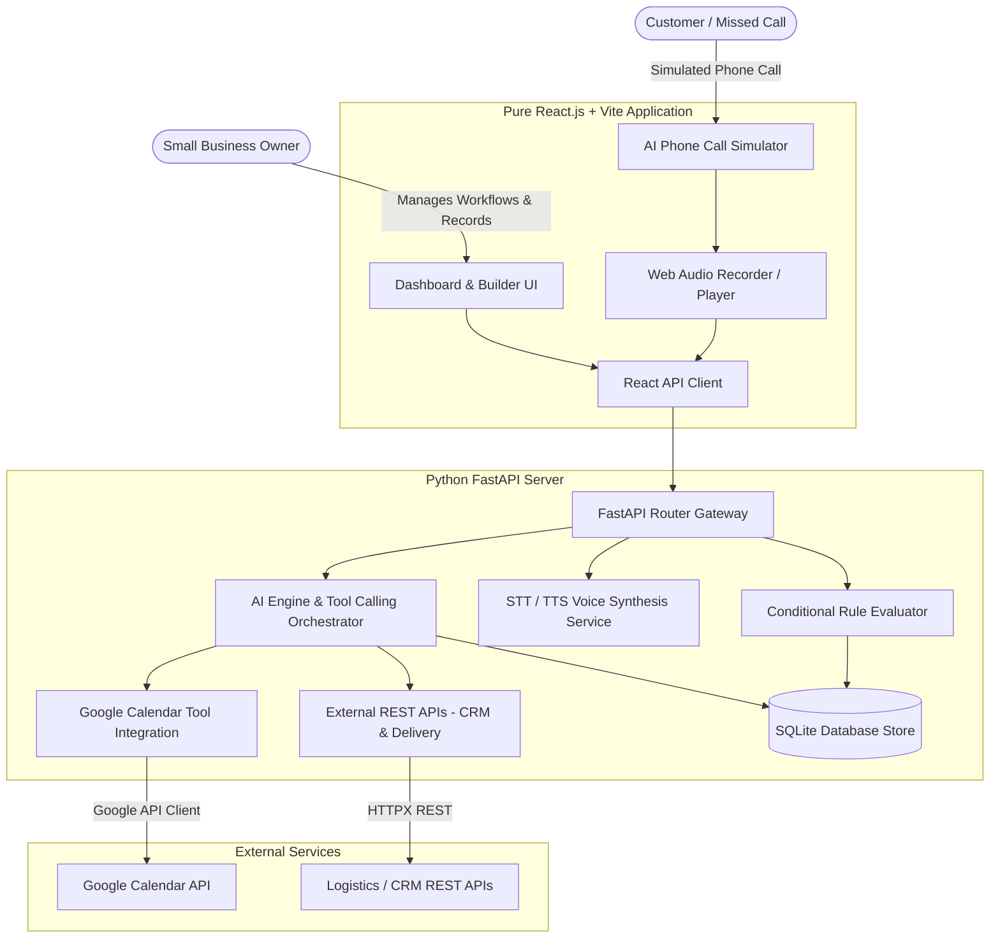
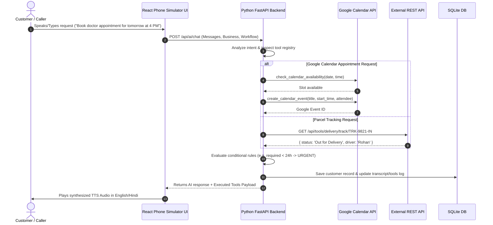

# System Architecture Blueprint - Python FastAPI & Pure React.js

This document details the decoupled architecture, tool calling execution engine, multi-language voice engine, and database models for the **Voice AI Personal Assistant**.

---

## 1. System Component Diagram



---

## 2. Directory Architecture

```text
voice_ai/
├── frontend/                     # Pure React.js (Vite + TS + Tailwind)
│   ├── src/
│   │   ├── components/           # Navbar, Dashboard, WorkflowBuilder, PhoneSimulator, BusinessProfiles, CalendarMonitor
│   │   ├── lib/                  # Frontend API Client
│   │   ├── types/                # Shared TypeScript types
│   │   ├── App.tsx               # Main React Component
│   │   ├── main.tsx              # React Entry point
│   │   └── index.css             # Glassmorphism Tailwind CSS
│   ├── index.html
│   ├── package.json
│   ├── vite.config.ts
│   └── tailwind.config.js
│
├── backend/                      # Python FastAPI Backend Server
│   ├── app/
│   │   ├── database.py           # SQLite connection & seed scripts
│   │   ├── models.py             # Pydantic schemas
│   │   ├── services/             # AI, Google Calendar, External REST API, Voice services
│   │   ├── routers/              # FastAPI endpoints (businesses, workflows, records, ai, tools)
│   │   └── main.py               # FastAPI entry point
│   ├── requirements.txt
│   └── data/                     # SQLite database file directory
│
├── .env.example                  # Environment variables template
├── ARCHITECTURE.md               # Architecture documentation
└── README.md                     # Setup instructions
```

---

## 3. Sequence Diagram for Tool Calling


