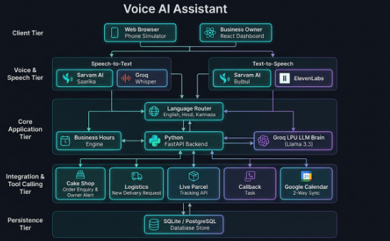
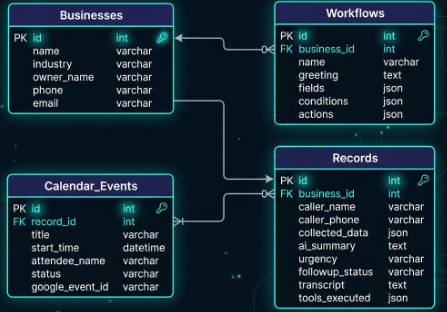

# 🎙️ Voice AI Personal Assistant

An enterprise-grade, multi-tenant, multi-industry **Voice AI Personal Assistant** and **Workflow Automation Platform** engineered for small and medium business owners. 

The system captures missed calls, conducts natural voice conversations in multiple languages (**English, Hindi, and Kannada**), dynamically evaluates business operating hours and conditional rules, executes AI tool calling (Google Calendar scheduling, real-time logistics tracking, CRM lookups), and manages customer records in an intuitive dashboard.

Architected with a **Python FastAPI** backend engine and a **React.js (Vite + TypeScript + Tailwind CSS)** frontend application.

---

## 📑 Table of Contents

- [Tech Stack](#-tech-stack)
- [Key Features](#-key-features)
- [Project Architecture](#-project-architecture)
- [Pre-Configured Demo Accounts](#-pre-configured-demo-accounts)
- [Prerequisites](#-prerequisites)
- [Setup Instructions](#-setup-instructions)
  - [Method 1: Local Development (Recommended)](#method-1-local-development-recommended)
  - [Method 2: Production Single-Server Mode](#method-2-production-single-server-mode)
  - [Method 3: Docker Container Deployment](#method-3-docker-container-deployment)
  - [Method 4: Cloud Deployment (Render Blueprint)](#method-4-cloud-deployment-render-blueprint)
- [Environment Variables Configuration](#-environment-variables-configuration)
- [Voice AI & LLM Engine Options](#-voice-ai--llm-engine-options)
- [API Endpoints Reference](#-api-endpoints-reference)
- [Testing & Verification](#-testing--verification)
- [Troubleshooting & FAQs](#-troubleshooting--faqs)

---

## 🌟 Tech Stack

| Layer | Technologies |
| :--- | :--- |
| **Backend API** | Python 3.10+, **FastAPI**, `uvicorn`, `pydantic`, `httpx`, `python-dotenv` |
| **Database & ORM** | **SQLite** (default zero-config in `backend/data/assistant.db`) or **PostgreSQL** via `sqlalchemy` & `pg8000` |
| **Frontend Web App** | **React 18**, **TypeScript**, **Vite**, **Tailwind CSS**, Lucide Icons, Glassmorphism UI |
| **AI LLM & Tool Calling**| **Groq Cloud LPU** (`llama-3.3-70b-versatile` with <300ms latency) / OpenAI / Gemini fallback |
| **Speech-to-Text (STT)** | **Groq Whisper Large v3**, **Sarvam AI Saarika v2.5** (Hindi/Kannada), **Deepgram Nova-2**, Web Speech API fallback |
| **Text-to-Speech (TTS)** | **Sarvam AI Bulbul v3**, **ElevenLabs Multilingual v2**, `gTTS` fallback |
| **Integrations** | Google Calendar REST API v3 (two-way sync), Logistics Webhook API |

---

## 🌟 Key Features

### 1. Multi-Industry Business Support
- 🍰 **Sweet Treats Bakery (Cake Shop)**: Collects cake flavor, weight, delivery date/time, custom message, delivery preference, and budget. Flags orders needed within 24 hours as **URGENT** priority.
- 🚚 **SwiftMove Express (Logistics & Delivery)**: Performs live package status tracking and dispatch requests using **External REST API Tool Calling** (`track_delivery_status` for waybill `#TRK-9821-IN`).

### 2. Interactive Phone Simulator
- Real-time simulated voice call interface with caller identification.
- Support for continuous hands-free audio streaming, manual push-to-talk, or text input fallback.
- Audio equalizer visualizer and live speech-to-text transcript feed.

### 3. Custom Workflow Builder
- Visual step-by-step workflow editor per business.
- Configurable triggers (Missed Call, After-Hours Call), opening greetings, required and optional data fields, conditional urgency rules, automated tool actions, and closing messages.

### 4. AI Tool Calling & Calendar Integration
- Real-time tool execution during voice conversation:
  - `check_calendar_availability`: Checks conflict-free slots on Google Calendar.
  - `create_calendar_event`: Books confirmed appointments directly.
  - `update_calendar_event` / `cancel_calendar_event`: Reschedules or cancels existing bookings.
  - `track_delivery_status`: Queries live parcel status.
  - `lookup_crm_customer`: Fetches customer profile and previous orders.

### 5. Multi-Language Intelligence
- Native multi-lingual processing in **English**, **Hindi (हिन्दी)**, and **Kannada (ಕನ್ನಡ)**.
- Dynamic language detection that automatically switches mid-call.

### 6. Small Business Management Dashboard
- Filter, inspect, and manage caller leads, collected customer details, AI conversation summaries, and priority tags (**Normal**, **Urgent**, **Critical**).
- One-click workflow status updates: *Pending*, *Owner Contacted*, *Completed*, *Closed*.

---

## 📁 Project Architecture

### 🏗️ System Architecture Diagram



### 🗄️ Database Schema & Entity Relationship Diagram (ERD)



### 📂 Directory Structure

```text
voice_ai/
├── docs/
│   └── images/                   # Architecture & ERD diagrams
│       ├── system-architecture.png
│       └── database-schema.png
├── backend/                      # Python FastAPI Application
│   ├── app/
│   │   ├── database.py           # SQLite & PostgreSQL engine, auto-migration & seed data
│   │   ├── models.py             # Pydantic data validation schemas
│   │   ├── services/
│   │   │   ├── ai_service.py     # AI Orchestrator, LLM inference & Tool Calling engine
│   │   │   ├── calendar_service.py # Google Calendar API integration
│   │   │   ├── external_api_service.py # Logistics & CRM tool integrations
│   │   │   └── voice_service.py  # STT / TTS audio synthesis engine
│   │   ├── routers/
│   │   │   ├── ai.py             # /api/ai/chat, /api/ai/tts, /api/ai/stt
│   │   │   ├── businesses.py     # /api/businesses (CRUD & authentication)
│   │   │   ├── workflows.py      # /api/workflows (Workflow builder rules)
│   │   │   ├── records.py        # /api/records (Call records & status)
│   │   │   ├── tools.py          # /api/tools (Calendar & logistics tool dispatch)
│   │   │   └── webhooks.py       # /api/webhooks (Missed call simulation hook)
│   │   └── main.py               # FastAPI entry point & static SPA file server
│   ├── data/                     # SQLite database storage (assistant.db)
│   └── requirements.txt          # Python dependencies
│
├── frontend/                     # Pure React.js Client Application
│   ├── src/
│   │   ├── components/
│   │   │   ├── Navbar.tsx        # Top navigation & business account switcher
│   │   │   ├── Dashboard.tsx     # Call records, lead management & analytics
│   │   │   ├── PhoneSimulator.tsx # Real-time caller voice simulation
│   │   │   ├── WorkflowBuilder.tsx # Drag/configure custom business workflows
│   │   │   ├── BusinessProfiles.tsx # Business hours & profile settings
│   │   │   ├── CalendarMonitor.tsx # Google Calendar live sync view
│   │   │   └── LoginModal.tsx    # Owner credential authentication modal
│   │   ├── lib/
│   │   │   └── api.ts            # Frontend REST API client
│   │   ├── types/
│   │   │   └── index.ts          # Shared TypeScript models
│   │   ├── App.tsx               # Root React component
│   │   ├── main.tsx              # DOM entry point
│   │   └── index.css             # Tailwind CSS styles & animations
│   ├── package.json              # Frontend dependencies
│   ├── vite.config.ts            # Vite bundler & backend proxy config
│   └── tailwind.config.js        # Tailwind styling configuration
│
├── .env.example                  # Environment configuration template
├── ARCHITECTURE.md               # Detailed system design & sequence diagrams
├── CREDENTIALS.md                # Demo account login directory
├── Dockerfile                    # Multi-stage production container build
├── package.json                  # Root build script
├── render.yaml                   # Render Cloud deployment blueprint
└── requirements.txt              # Root Python dependencies
```

---

## 🔑 Pre-Configured Demo Accounts

The database comes pre-seeded with 5 realistic business accounts and 1 Master Admin account. Use these credentials to sign in at `http://localhost:3000`:

| Business Name | Industry | Owner | Email Address | Password |
| :--- | :--- | :--- | :--- | :--- |
| **Sweet Treats Bakery** | Cake Shop | Ananya Sharma | `orders@sweettreats.com` | `password123` |
| **Apex Health Clinic** | Clinic / Healthcare | Dr. Ramesh Kumar | `contact@apexcare.com` | `password123` |
| **SwiftMove Express** | Logistics & Delivery | Vikram Singh | `support@swiftmove.com` | `password123` |
| **Prime Haven Realty** | Real Estate | Rajesh Mehta | `sales@primehaven.com` | `password123` |
| **FixIt Pro Maintenance** | Home Repair | Suresh Babu | `dispatch@fixitpro.com` | `password123` |
| **Master Admin** | All Accounts View | Platform Admin | `admin@voiceassistant.ai` | `password123` |

> [!TIP]
> On the web login screen, you can click on any pre-configured card in the credentials helper to instantly autofill the form!

---

## 📋 Prerequisites

Make sure you have the following installed on your machine:
- **Python**: Version `3.10` or higher (`python --version` or `python3 --version`)
- **Node.js**: Version `18.0.0` or higher (`node --version`)
- **npm**: Version `9.0.0` or higher (`npm --version`)
- **Git**: For cloning the repository
- *(Optional)* **Docker**: If running via containers

---

## 🚀 Setup Instructions

### Method 1: Local Development (Recommended)

Run the backend and frontend in separate terminals with hot-reloading enabled.

#### Step 1: Clone the Repository
```bash
git clone https://github.com/your-username/voice_ai.git
cd voice_ai
```

#### Step 2: Set Up Backend (Python FastAPI)

1. Navigate to the backend directory:
   ```bash
   cd backend
   ```

2. Create and activate a Python virtual environment:
   - **Windows (PowerShell)**:
     ```powershell
     python -m venv venv
     .\venv\Scripts\Activate.ps1
     ```
   - **Windows (Command Prompt)**:
     ```cmd
     python -m venv venv
     .\venv\Scripts\activate.bat
     ```
   - **macOS / Linux**:
     ```bash
     python3 -m venv venv
     source venv/bin/activate
     ```

3. Install required Python packages:
   ```bash
   pip install -r requirements.txt
   ```

4. *(Optional)* Configure Environment Variables:
   Copy `.env.example` to `backend/.env` (or root `.env`):
   - **Windows**:
     ```powershell
     copy ..\.env.example .env
     ```
   - **macOS / Linux**:
     ```bash
     cp ../.env.example .env
     ```
   *(By default, the backend will automatically use SQLite in `backend/data/assistant.db` with built-in fallbacks if no API keys are provided).*

5. Start the FastAPI server:
   ```bash
   python -m app.main
   ```
   *Or using uvicorn directly:*
   ```bash
   uvicorn app.main:app --host 0.0.0.0 --port 8000 --reload
   ```

6. Confirm the backend is running:
   - **API Server**: [http://localhost:8000](http://localhost:8000)
   - **Interactive API Documentation (Swagger UI)**: [http://localhost:8000/docs](http://localhost:8000/docs)
   - **Health Check**: [http://localhost:8000/health](http://localhost:8000/health)

---

#### Step 3: Set Up Frontend (React.js + Vite)

1. Open a **new terminal window** and navigate to the `frontend` folder:
   ```bash
   cd frontend
   ```

2. Install npm dependencies:
   ```bash
   npm install
   ```

3. Launch the Vite development server:
   ```bash
   npm run dev
   ```

4. Open your browser and navigate to:
   **[http://localhost:3000](http://localhost:3000)**

The Vite development server is pre-configured to proxy all `/api` requests to `http://localhost:8000`.

---

### Method 2: Production Single-Server Mode

In production mode, the React frontend is compiled into static assets (`frontend/dist`) and served directly by FastAPI from a single port.

1. Build the React frontend:
   ```bash
   cd frontend
   npm install
   npm run build
   cd ..
   ```

2. Install root Python dependencies:
   ```bash
   pip install -r requirements.txt
   ```

3. Launch the production server:
   ```bash
   uvicorn backend.app.main:app --host 0.0.0.0 --port 8000
   ```

4. Open **[http://localhost:8000](http://localhost:8000)** in your browser. The single server now serves both the frontend SPA and the backend API!

---

### Method 3: Docker Container Deployment

The repository includes a multi-stage `Dockerfile` that builds the React application and serves it via FastAPI.

1. Build the Docker image:
   ```bash
   docker build -t voice-ai-assistant .
   ```

2. Run the container:
   ```bash
   docker run -d -p 10000:10000 --name voice-ai-app voice-ai-assistant
   ```

   *(Optional: pass an environment file with your API keys):*
   ```bash
   docker run -d -p 10000:10000 --env-file .env --name voice-ai-app voice-ai-assistant
   ```

3. Access the application at **[http://localhost:10000](http://localhost:10000)**.

---

### Method 4: Cloud Deployment (Render Blueprint)

This project contains a ready-to-deploy [`render.yaml`](file:///d:/voice_ai/render.yaml) blueprint.

#### Automated 1-Click Blueprint
1. Push your code to GitHub or GitLab.
2. Log in to the [Render Dashboard](https://dashboard.render.com).
3. Click **New +** > **Blueprint**.
4. Connect your repository. Render will automatically read `render.yaml`, configure the environment, and trigger the build.
5. In the Environment settings, provide any optional API keys (e.g., `GROQ_API_KEY`, `GOOGLE_CLIENT_ID`, etc.).
6. Click **Apply**. Render will deploy your unified app on an `https://<your-service>.onrender.com` URL.

#### Manual Web Service on Render
If setting up manually:
- **Environment**: `Python 3`
- **Build Command**: `pip install -r requirements.txt && cd frontend && npm install && npm run build`
- **Start Command**: `uvicorn backend.app.main:app --host 0.0.0.0 --port $PORT`
- **Port**: Set environment variable `PORT` to `10000`.

---

## ⚙️ Environment Variables Configuration

Copy `.env.example` to `.env` to customize settings. All keys are optional—the system operates seamlessly with local SQLite and intelligent fallback engines even with empty keys.

| Variable | Description | Default / Fallback |
| :--- | :--- | :--- |
| `PORT` | Port for the FastAPI server | `8000` (Local) / `10000` (Docker/Render) |
| `DATABASE_URL` | PostgreSQL connection URL (Neon, Supabase, AWS RDS, local Postgres) | Local SQLite (`backend/data/assistant.db`) |
| `GROQ_API_KEY` | Groq Cloud API Key for ultra-fast LPU inference (Llama 3.3 70B & Whisper STT) | Rule-based intelligent fallback |
| `DEEPGRAM_API_KEY` | Deepgram API key for Nova-2 Speech-to-Text | Whisper / Browser Web Speech API |
| `SARVAM_API_KEY` | Sarvam AI key for Hindi & Kannada Saarika STT and Bulbul TTS | Multilingual / gTTS engine |
| `ELEVENLABS_API_KEY` | ElevenLabs API key for ultra-realistic studio voices | gTTS / browser synthesis |
| `ELEVENLABS_VOICE_ID`| ElevenLabs Voice ID for speech playback | `21m00Tcm4TlvDq8ikWAM` |
| `GOOGLE_CLIENT_ID` | Google OAuth 2.0 Client ID for Calendar API | Mock calendar store |
| `GOOGLE_CLIENT_SECRET`| Google OAuth 2.0 Client Secret | Mock calendar store |
| `GOOGLE_REFRESH_TOKEN`| Google OAuth 2.0 Refresh Token for offline calendar access | Mock calendar store |
| `GOOGLE_CALENDAR_ID` | Target Google Calendar ID | `primary` |

---

## 🎙️ Voice AI & LLM Engine Options

The platform employs a cascading multi-tier architecture to ensure high reliability:

1. **LLM Inference**:
   - **Primary**: Groq LPU `llama-3.3-70b-versatile` (<300ms latency, native JSON tool calling).
   - **Fallback**: Context-aware rule and intent extraction engine.

2. **Speech-to-Text (STT)**:
   - **Indian Languages (Hindi & Kannada)**: Sarvam AI `saarika:v2.5`.
   - **English & Global**: Groq Whisper Large v3 or Deepgram Nova-2.
   - **Browser Fallback**: HTML5 Web Speech Recognition API.

3. **Text-to-Speech (TTS)**:
   - **Indian Languages**: Sarvam AI `bulbul:v3` (authentic Indian accents).
   - **Ultra-Realistic**: ElevenLabs Multilingual v2.
   - **Standard Fallback**: Google Text-to-Speech (`gTTS`) streaming audio.

---

## 🔌 API Endpoints Reference

Explore the full interactive documentation at `http://localhost:8000/docs`.

### Core Routes Summary:
- **`GET /health`**: Health check and server status.
- **`GET /api/businesses`**: Retrieve all business profiles.
- **`POST /api/businesses/login`**: Authenticate business owner.
- **`PUT /api/businesses/{id}`**: Update business hours and profile configurations.
- **`GET /api/workflows/{business_id}`**: Fetch workflow configuration for a business.
- **`PUT /api/workflows/{business_id}`**: Save updated workflow steps and conditional rules.
- **`GET /api/records`**: List all missed call records (supports `?business_id=` filter).
- **`PATCH /api/records/{id}/status`**: Update record status (*Pending*, *Owner Contacted*, *Completed*, *Closed*).
- **`POST /api/ai/chat`**: Process conversation turn with LLM, rule engine, and tool calling.
- **`POST /api/ai/stt`**: Transcribe uploaded voice audio to text.
- **`POST /api/ai/tts`**: Synthesize response text into playable voice audio stream.
- **`POST /api/tools/execute`**: Directly invoke an automated tool (`check_calendar_availability`, `create_calendar_event`, `track_delivery_status`, etc.).
- **`POST /api/webhooks/missed-call`**: Webhook endpoint to trigger an automated outbound voice workflow.

---

## 🧪 Testing & Verification

### 1. Verify Backend Health
```bash
curl http://localhost:8000/health
```
Expected response:
```json
{
  "status": "online",
  "system": "Python FastAPI Voice AI Backend",
  "version": "1.0.0"
}
```

### 2. Verify Database Seeding
Open `http://localhost:8000/docs` and execute `GET /api/businesses`. You should see all 5 pre-configured businesses returned.

### 3. Verify Frontend Build
To ensure TypeScript and bundler integrity:
```bash
cd frontend
npm run build
```

### 4. Interactive Call Simulator Test
1. Log into `http://localhost:3000` using `contact@apexcare.com` / `password123`.
2. Click on the **Simulator** tab in the top navigation.
3. Choose a caller profile (e.g. *Rahul Sharma - Apex Clinic Appointment*).
4. Click **Start Call**. The voice assistant will greet you with the business's custom opening voice message.
5. Say or type: *"I would like to book an appointment with Dr. Kumar for tomorrow at 10 AM."*
6. Observe the tool calling indicator triggering `check_calendar_availability` and `create_calendar_event`.
7. Navigate to the **Dashboard** or **Calendar** tab to view the newly saved record!

---

## ❓ Troubleshooting & FAQs

### Port Already in Use (`Error: listen EADDRINUSE: address already in use :::3000` or `8000`)
- **Port 8000**:
  - Windows: `netstat -ano | findstr :8000` then `taskkill /PID <PID> /F`
  - macOS/Linux: `lsof -ti :8000 | xargs kill -9`
- **Port 3000**:
  - Specify a different port for Vite: `npm run dev -- --port 3001`.

### SQLite Database Locked or Permission Error
- Ensure the `backend/data/` directory has write permissions.
- On serverless/container runtimes where local disk is read-only, configure `DATABASE_URL` with a cloud PostgreSQL connection string (such as [Neon](https://neon.tech) or [Supabase](https://supabase.com)).

### Microphone / Speech Recognition Not Working in Browser
- Chrome and modern browsers require **HTTPS** or **localhost** to grant microphone permissions. Ensure you access the app via `http://localhost:3000` (not via raw local IP like `http://192.168.x.x`) unless HTTPS is configured.
- Ensure microphone permissions are allowed in your browser address bar settings.

### Vite Frontend Cannot Connect to Backend (`404` or `500` on `/api/*`)
- Confirm the FastAPI backend server is running on `http://localhost:8000`.
- Verify that `frontend/vite.config.ts` has the proxy target set to `http://localhost:8000`.

---

## 📄 License

This project is licensed under the MIT License - feel free to use and extend it for your business automation needs.
